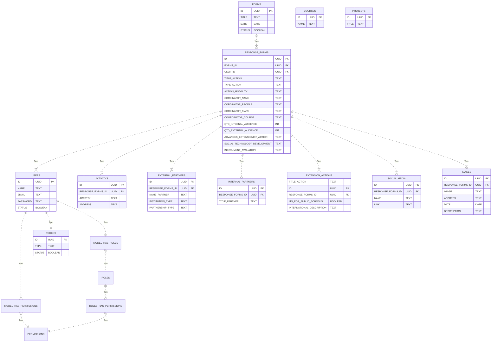

<p align="center"><a href="https://laravel.com" target="_blank"></a></p>

## Instruções de inicialização:

### Após ter feito o clone do repositório, acesse a pasta do projeto:
```sh
cd app-laravel
```

### Instale as dependências do Composer dentro do projeto:
```sh
composer install
```
### Crie um arquivo .env a partir do arquivo .env.example
```sh
cp .env.example .env
```

### No arquivo .env substitua as configurações de conexão do banco de dados para:
```sh
DB_CONNECTION=sqlite
```

### Crie uma conta no mailtrap.io para gerar as credenciais para receber os emails e cole no arquivo .env:
```sh
MAIL_MAILER=smtp
MAIL_HOST=
MAIL_PORT=
MAIL_USERNAME=
MAIL_PASSWORD=
```

### Atualize seu .env para fazer upload na pasta public:
```sh
FILESYSTEM_DISK=public
```

### Gere a key do projeto laravel:
```sh
php artisan key:generate
```

### Ainda dentro do terminal rode o comando para criar as migrations do banco de dados:
```sh
php artisan migrate --seed
```

### Para usar o storage do laravel e permitir anexos das imagens, rode esse comando:
```sh
php artisan storage:link
```

### Para inicializar os listeners abra um terminal em rode:
```sh
php artisan queue:listen
```

### Para inicializar o servidor e rodar o projeto rode:
```sh
php artisan serve
```
### Instruções do banco de dados:

